## Overview

This web application was created for an Algerian government administration, specifically the Youth and Sports Direction of Bejaia state, often called DJS ("Direction de la jeunesse et des sports"). The main responsibility of this administration, which operates under the Youth and Sports Ministry and the state's head ("wali"), is to supervise the activities and performance of all sports clubs and cultural associations in the state and allocate the appropriate monetary aid to each association accordingly.

In practice, this means that the DJS primarily needs to maintain an up-to-date profile of each association. Whenever the budget becomes available, it should promptly distribute a tailor-made financing contract to each association, which amounts to nearly 2000 organizations, as quickly as possible.

## Project State

This project is a prototype developed by Youcef DEBBAH in 2019 during their tenure at NGNEX-Soft. While this version is open-source (excluding database data), there is another production version that underwent significant improvements, including performance optimizations, vulnerability fixes, and the addition of extra features. Regrettably, the production version is not open-source and was maintained by NGNEX-Soft until 2022, when it was eventually replaced by a national-scale web application offering similar functionalities.

In summary, the project has been inactive since 2022, and this repository has not seen any significant updates since 2020. Nevertheless, it is an illustrative example of a JSF-based web application that doesn't resemble the design aesthetics of websites from the 1980s.

## Features

This repository is primarily designed to assist students new to web development, as it aims to serve as an example for those learning the ropes in this field. As a student, I wished for a practical example like this. In any case, if you're interested in this project, you might be curious about the specific features it implements; the sections below cover the main features of this web app.

### Standard Features

To provide a comprehensive understanding of this web application, let's begin with its standard features commonly found in most well-designed websites:

#### Static Content

The core element of any website is its web pages. Although this web application technically doesn't have "static pages," as all pages are constructed using custom JSF tags in XHTML (a special XML file with syntax similar to HTML), the JSF runtime dynamically generates the actual HTML from the XHTML source code.
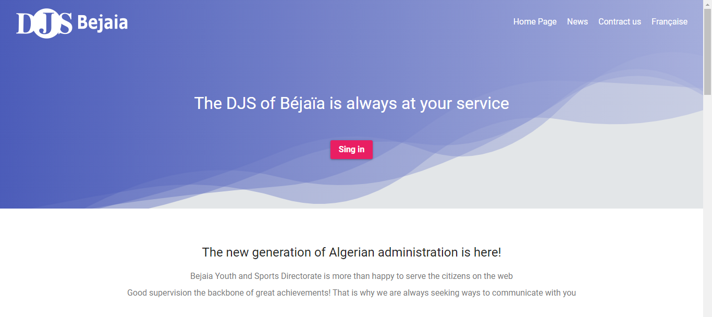

These pages encompass the home page, an about us page, descriptions of various DJS offices and services, and more. While the primary language of this web application is French, English is also supported. This support extends not only to the JSF level (utilizing two separate resource bundles for each language) but also across all application layers. For example, when creating a new blog article, you can input both French and English titles.

Similarly, the application is customized to Algerian standards for localization, including aspects such as phone numbers and currency amounts. After all, it's essential to tailor your app to the specific audience it serves rather than attempting a generalized approach that may not align with the user base.
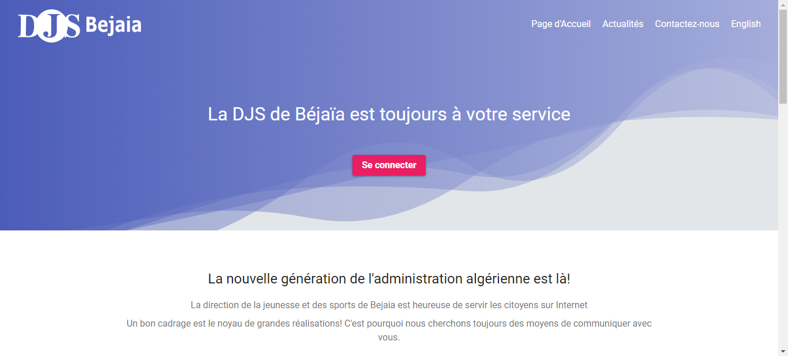

#### Security

This application features four types of user accounts: sports club admins, cultural association admins, super admins, and regular users with club/association accounts. Please note that in this version, much of the security-related code is either commented out or not fully implemented, as it primarily served as a prototype. When developing your application, consider security measures such as HTTPS, SQL encoding, HTML encoding, and redundant permission checks from the outset. Some security measures are easier to implement during development while addressing them later can be more challenging.
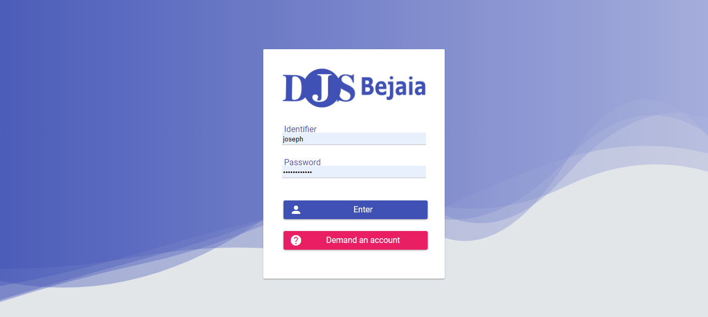

#### Feedback

Continuous feedback is crucial for software development, whether from users, tech support, automated crash/error reports, or any other source. In this web application, users can chat with the administration (implemented using web sockets) or leave comments on blog articles. Administrators, on the other hand, have the ability to engage in chat and comment, as well as broadcast global messages. Additionally, Crashlytics and Google Analytics have been integrated into the production version to monitor errors, user behavior, and performance.
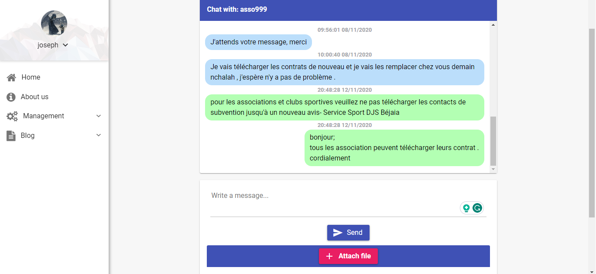

#### Blog

The application includes a simple embedded blog feature that allows administrators to publish articles. Here's an overview of how the blog feature functions:

- **Blog News:** The administration can post publications of their choice, and here's what the list of publications looks like.
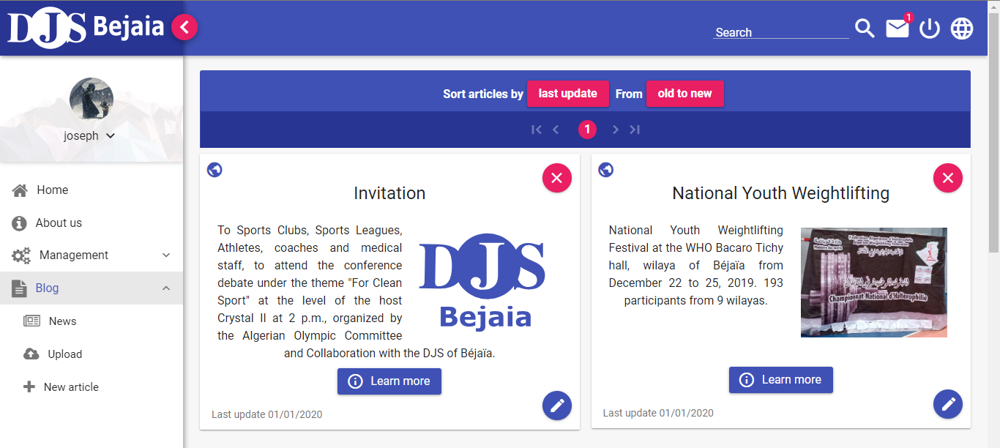

- **File Upload:** When an admin wishes to create a new post, they must upload all the necessary images/files that will be used in the article.
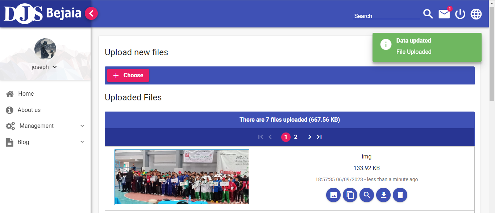

- **Article Information Form:** After uploading the necessary files, the admin provides the title summary description and selects the appropriate summary thumbnail from the uploaded files.
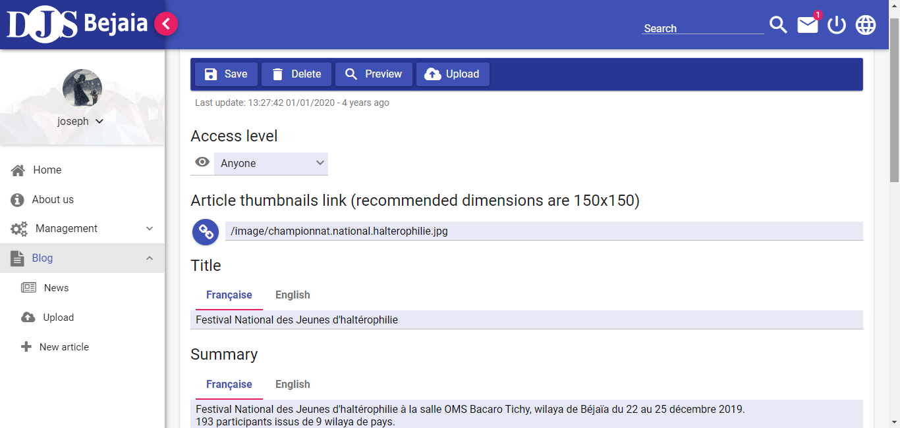

- **Article Content Editor:** The article content can be edited using [CKEditor](https://ckeditor.com/). The admins can browse the list of uploaded files and copy a link to any file, which can then be used in the editor to embed an image, create a link, etc.
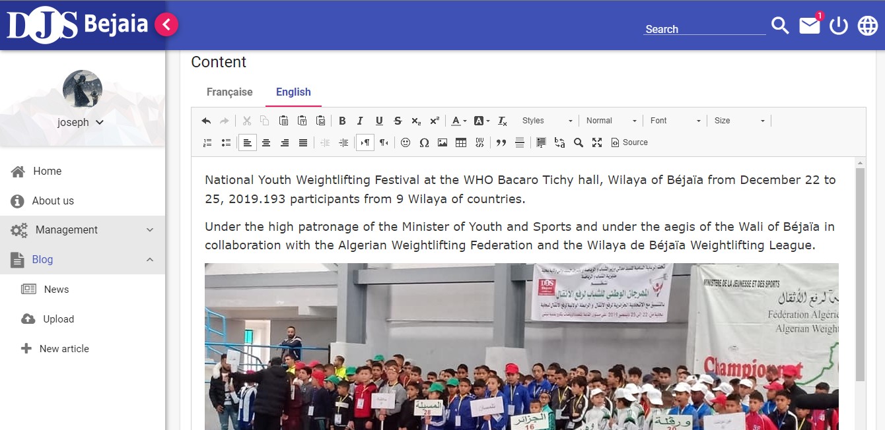

### DJS-Related Features

The primary screen that concerns the DJS (Direction de la Jeunesse et des Sports) is the list of clubs/associations. They can use this screen to search for a specific club/association to quickly check if they have downloaded their assigned contract (represented by small icons on the left), engage in chat, view the contract details, and more.
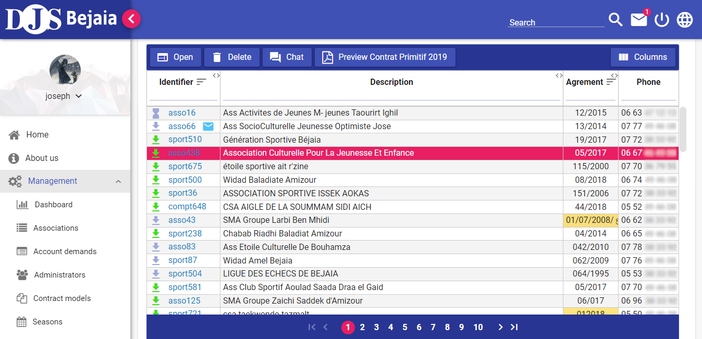

When a club/association is opened from the main list, all its information is displayed on a single page. This includes the currently assigned contract, previous contacts, organizational details, banking information, allocated budgets, achievements from past seasons/years, and more. Some input fields depend on the current assigned contract. Some are provided by the clubs/associations, the DJS inputs others, while both parties can edit some.


The contract editor not only affects the contract contents (similar to article content editing, as described in the **Blog** section) but also defines the variables that may be included in the contract and displayed in the profiles of all associations assigned to the contract being edited. When declaring a new variable, you can specify who can provide its value (the association, the DJS, or both), the label of the input, the type of input (phone number, money value, arbitrary text, etc.), how it will be formatted within the contract, and more. This approach makes the contracts highly customizable. When creating a new contract, the DJS admins need only to copy one of the old contracts (provided by the developer) and adapt it to their specific needs.
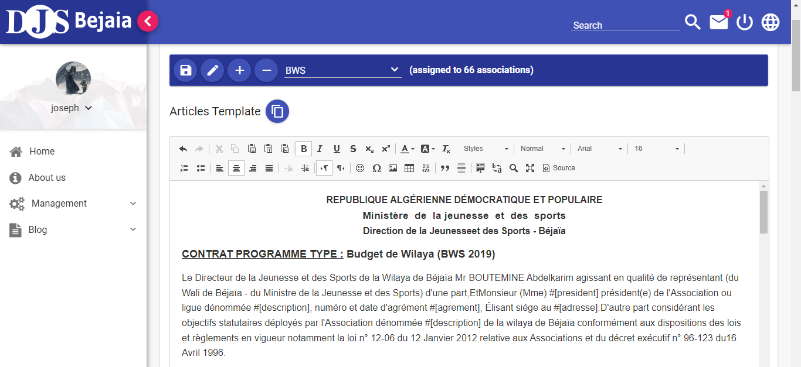

While editing a contract, it's helpful to open a live preview in another tab to see how the changes affect the resulting PDF document. Checking the profile may also be necessary, as the variables declared in the contract affect the input forms on the profile page. Although editing a contract can sometimes be a little complex, it is typically not a frequent task, with contracts often being edited once or twice a year, mostly by copying old contracts and updating only what is necessary.
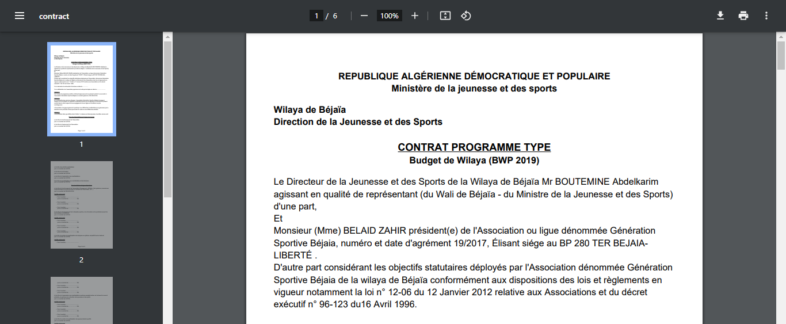

Having a general overview of your website is always a good idea, but the dashboard in this web application is not just for show. It contains numerous metrics that are directly included in the reports the DJS sends to the Ministry and the state's leadership.
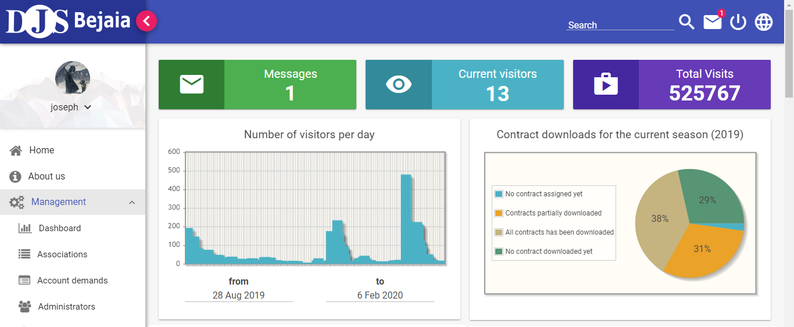

Most statistics are based on the current season, which includes multiple active contracts. Statistics about old contracts are available on the Archive page. The dashboard page may initially appear crowded with data, but this design has been intentionally crafted based on DJS recommendations.
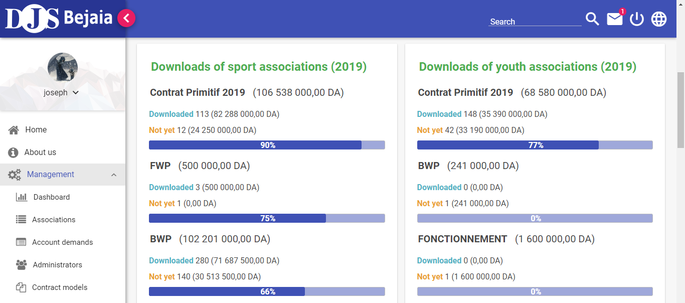

## Design Philosophy

Since the first meeting I had about this project, I had some principles that I wanted to apply:

- **Layered Architecture:** I employ a layered architecture approach, ensuring a clear separation between the views, view models, business logic, and persisted data. This separation enhances modularity, maintainability, and scalability.

- **Consistent UI Design:** My goal is to provide an appealing and consistent user interface (UI) design across all pages while adhering to Google's Material Design principles. This consistency not only enhances the user experience but also reinforces my commitment to quality.

- **Content-Centric UI:** I prioritize content over unnecessary visual elements. My UI design aims for efficiency, creating a dashboard-like experience that focuses on delivering valuable information without clutter.

- **Practical Database Schema:** I strive for a pragmatic database schema that is not too much micro-normalized until it's hard and inefficient to deal with or too much app-based until it is hard to exploit by other apps or tools.

## Installation

Unfortunately, I cannot provide the real database (except the table's schema) nor the production version (that contains some drastic performance and security fixes), but in case anyone is interested in installing this web app (for example, to be used as a sandbox for experimenting while learning) follow the instruction bellow.

These instructions will guide you to install this web app on your local Windows machine:

### Prepare the installation ingredients

Before you start, you need to download/setup a few things:

#### 1. The war file

The War file contains the whole application code. You can get it by:

- Building your own version by cloning this repository and running the `assemble` gradle task, for example, like this: `./gradlew clean assemble --stacktrace`
- Downloading a pre-built version of the [war file](https://drive.google.com/file/d/1SaTWhKLVhKZEb3sOvpbIqnDKecCsuAZK/view?usp=sharing).

#### 2. The database

The database schema is all I can provide. You can download the [schema.sql](schema.sql) file from this repository.

#### 3. Download MySQL installer

You only need to download the installer version 5.7 later versions will probably also work, but it hasn't been tested properly. by the "installer", we mean the all-in-one MySQL installer that lets you install many components along the database server itself and since there are some plans to replace this installer in the future you may need to look in the "old download" section to find in the [MySQL website](https://dev.mysql.com/downloads/installer/).

#### 4. Wildfly server

- Download the Wildfly 21 zip file from [here](https://download.jboss.org/wildfly/21.0.2.Final/wildfly-21.0.2.Final.zip)

#### 5. Java Runtime Environment

- Download and Install the latest [Java 8](https://www.oracle.com/java/technologies/javase/javase8-archive-downloads.html) or [Java 11](https://www.oracle.com/java/technologies/javase/jdk11-archive-downloads.html). **Even** if you have a newer major version installed, it is still recommended to install Java 8 or 11 (not 9 or 10) because Wildfly 21 (the Server that will host this web app) doesn't support Java 12-13 property (and probably will not even run on Java 14) This limitation is mainly because this prototype version uses some old security configs that are not supported in Wildfly 22+ (while the latest production version run on Wildly 25).
- Set the JAVA_HOME system environment variable to the installation dir of your Java 8 or Java 11.

### Setup the app

At this point, you should have Java 8 or Java 11 installed, with your JAVA_HOME env var pointing to its installation dir. In addition to that you should have:

- the .war file (the app)
- the .sql file (the database)
- MySQL installer (database server)
- Wildfly zip file (the web server)

If you are missing anything mentioned here check the previous section on how to download it.

Before you start setting up the app keep in mind that this is only a prototype version, and most deployment info is simply hardcoded in the app itself, of course in the production version, these configs are read from the environment and provided as secrets to the hosting Openshift cloud (one of the most secure clouds in the web nowadays) but in this particular installation retain from changing anything (database name, port, etc.)

#### Setup MySQL Server

- open MySQL installer
- At the beginning of the installation, make sure these 3 components are selected: MySQL server, JConnector, and Workbench.
- At the end of the installation, make sure MySQL Server is using default port: 3306, and add a new database user named "ngnex" with the password "EoYBCajN2ES0mZebkBjw"
- After the installation, open the Workbench app, select `File`, then `Run SQL Script...` choose the [schema.sql](schema.sql) file that you have downloaded and import it

Your database server should be running now with a database named `djs_db` that contains 25 table

### Setup Wildfly Server
- Unzip the Wildfly zip file to your installation distinction
- Add an admin user by running this cmd command from inside the wildfly-21.0.2.Final\bin dir (use cd command if needed): `add-user -u manager -p manager-password`
- Start the server by opening this file: wildfly-21.0.2.Final\bin\standalone.bat
- The server needs a few seconds to start, in the meanwhile find where your mysql connector jar is located (by default it is installed on: C:\Program Files\MySQL\Connector J 8.0), you can also download it if you can't find it from (here)[https://repo1.maven.org/maven2/com/mysql/mysql-connector-j/8.0.33/mysql-connector-j-8.0.33.jar], make sure to **rename** the jar file to `mysql-connector-java.jar` (without any version numbers at the end)
- Login to the admin console on this link: localhost:9990/ with user: `manager` and password: `manager-password`
- Select `Deployments` and upload your MySQL java connector .jar
- Stop Wildfly server from its cmd window by pressing Ctrl+C (sometimes you need to press it more than once), then type "Yes" and hit `Enter` (the cmd widows should close on its own)
- Start the server again (from standalone.bat), and wait a few second until it is started then open a another (second) cmd windows to connect to the started wildfly server from the command line, inside this new window use `cd` command to move into your wildfly-21.0.2.Final\bin dir then run `jboss-cli --connect`
- when you are connected (you see: `standalone@localhost` before your prompt) run each of the configurations below, ensure that (after you copy and past the config and hit enter) you get `"outcome" => "success"` if didn't then restart the server by stopping it as mentioned earlier (not by simply closing the cmd windows) then run standalone.bat again and connect to it again using the `jboss-cli --connect`, there are all the configs that you will need to execute:

```
data-source add --name=MySQLDS --jndi-name=java:jboss/datasources/MySQLDS --driver-name=mysql-connector-java.jar --connection-url=jdbc:mysql://localhost:3306/djs_db?useSSL=false&useUnicode=yes&characterEncoding=UTF-8&useJDBCCompliantTimezoneShift=true&useLegacyDatetimeCode=false&serverTimezone=UTC&allowPublicKeyRetrieval=true&pooling=false&autoReconnect=true&zeroDateTimeBehavior=convertToNull&useLocalSessionState=true&pinGlobalTxToPhysicalConnection=true --user-name=ngnex --password=EoYBCajN2ES0mZebkBjw
```

```
/subsystem=datasources/data-source=MySQLDS:test-connection-in-pool()
```

```
/subsystem=elytron/jdbc-realm=main_realm:add(principal-query=[{sql="SELECT `principal`.`password`, `principal`.`role` FROM (SELECT `admin`.`name`, `admin`.`role`, `admin`.`password` FROM `admin` UNION SELECT `sport_association`.`name`, 'sport_asso' as 'role', `sport_association`.`password` FROM `sport_association` UNION SELECT `youth_association`.`name`, 'youth_asso' as 'role', `youth_association`.`password` FROM `youth_association`) AS `principal` WHERE `principal`.`name` = ?", data-source=MySQLDS, attribute-mapping=[{index=2, to=groups }] clear-password-mapper={password-index=1} }])
```

```
/subsystem=elytron/security-domain=main_domain:add(realms=[{realm=main_realm,role-decoder=groups-to-roles}],default-realm=main_realm,permission-mapper=default-permission-mapper)
```

```
/subsystem=elytron/http-authentication-factory=main_http_auth:add(http-server-mechanism-factory=global,security-domain=main_domain,mechanism-configurations=[{mechanism-name=FORM,mechanism-realm-configurations=[{realm-name=main_domain}]}])
```

```
/subsystem=undertow/application-security-domain=main_domain:add(http-authentication-factory=main_http_auth)
```

```
/subsystem=ejb3/application-security-domain=main_domain:add(security-domain=main_domain)
```

- Stop the server as mentioned earlier (not by just closing the cmd windows)
- Copy the war file to: wildfly-21.0.2.Final\standalone\deployments folder
- Config the server to allocate more Heap memory (the application needs at least 1GB to work properly but by default only 512MB is granted) by editing the file: wildfly-21.0.0.Final\bin\standalone.conf.bat, go just after this line:

```
rem # JVM memory allocation pool parameters - modify as appropriate.
```

and update this:

```
set "JAVA_OPTS=-Xms64M -Xmx512M -XX:MetaspaceSize=96M -XX:MaxMetaspaceSize=256m"
```

to this (this will give the app 2GB of memory):

```
set "JAVA_OPTS=-Xms512M -Xmx2048M -XX:MetaspaceSize=128M -XX:MaxMetaspaceSize=512m"
```

- That's it! run the standalone.bat and wait until the server is up then visit: http://localhost:8080/landing.xhtml

## License

This project is licensed under the [Apache License 2.0](LICENSE.txt).

You are free to:

- **Share:** Copy and redistribute the material in any medium or format.
- **Adapt:** Remix, transform, and build upon the material for any purpose, even commercially.

Under the following terms:

- **Attribution:** You must give appropriate credit, provide a link to the license, and indicate if changes were made. You may do so in any reasonable manner, but not in any way that suggests the licensor endorses you or your use.
- **No Additional Restrictions:** You may not apply legal terms or technological measures that legally restrict others from doing anything the license permits.

For more details about the Apache License 2.0, please refer to the [LICENSE](LICENSE.txt) file.

## Contact Us

If you have any questions or inquiries about this project, please don't hesitate to contact the main developer at [youcef-debbah@hotmail.com](mailto:youcef-debbah@hotmail.com).
